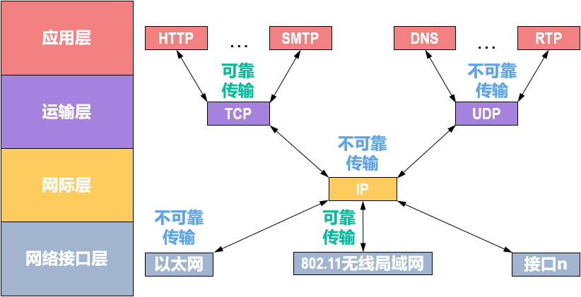
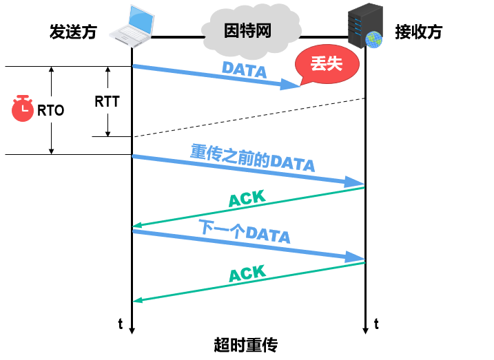
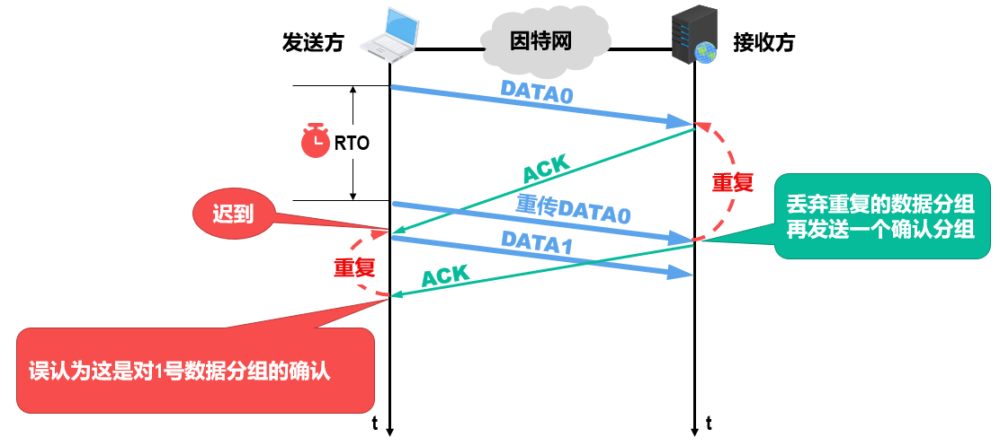
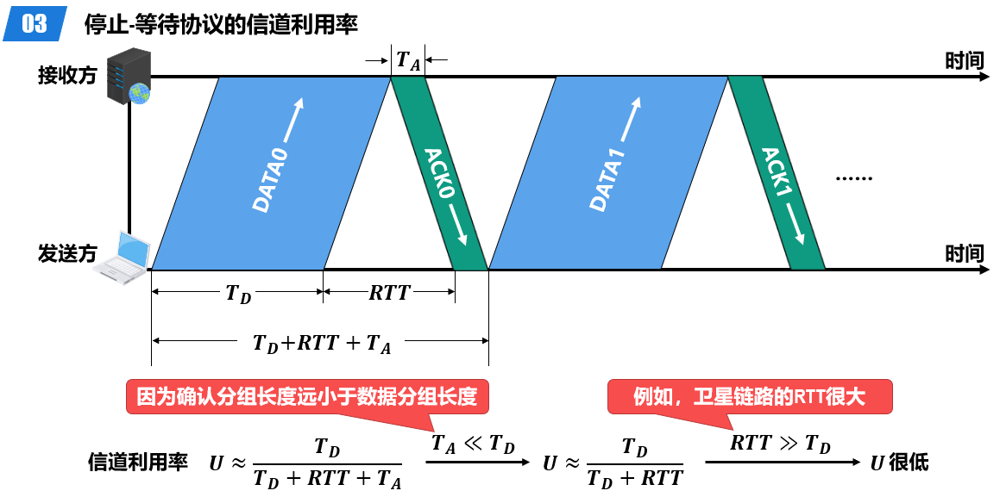
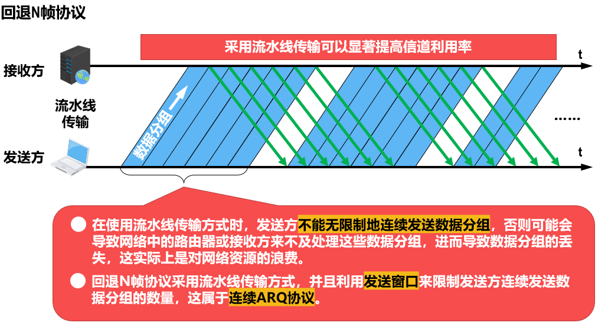
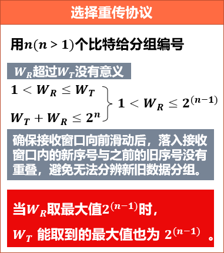

# 可靠传输

## 简介

* **不可靠传输服务**：仅仅丢弃有误码的帧，其他什么也不做；
* **可靠传输服务**：通过某种机制实现发送方发送什么，接收方最终就能收到什么。

无线链路易受干扰，误码率比较高，因此要求数据链路层必须向其上层提供可靠传输服务。

可靠传输服务并不局限于数据链路层，其他各层**均可选择**实现可靠传输。
其实现比较复杂，开销比较大，是否使用可靠传输取决于应用需求。

## 传输差错

|类型|位置|例子|
|-|-|-|
|分组丢失|↓|因为输入队列快满，主动丢弃收到的分组|
|分组失序|↓|分不同节点发送，导致分组到达顺序与发送顺序不同|
|分组重复|出现在数据链路层的上层|之前的阻塞导致超时重发|
|误码（比特差错）|出现在数据链路层及其下层|使用差错检测技术，接收方在数据链路层检测出帧在传输过程中产生了误码|

## 停止-等待协议

### 无差错情况

先简单给出无差错情况的示例

`发送方` : 发送 0 帧（数据分组**DATA 0**）;
`接收方` : 接收 0 帧 , 并返回 0 帧 确认信息 **ACK 0**;
`发送方` : 收到**ACK 0**确认帧后 , 发送 1 帧（数据分组**DATA 1**） ;
`接收方` : 接收 1 帧 , 并返回 1 帧 确认信息 **ACK 1** ;
`发送方` : 收到**ACK 1**确认帧后 , 发送 0 帧。（此处的DATA 0与上面的只是序号相同 , 数据不同）;
`接收方` : 接收 0 帧 , 并返回 0 帧 确认信息 **ACK 0** ;

### 差错情况

下面介绍停等协议的一些特点和对应的差错情况

* **超时重传**：接收方收不到数据分组，就不会发送相应的ACK或NAK。如果不采取措施，发送方就会一直处于等待接收方ACK或NAK的状态。
停等协议属于**自动请求重传**(Automatic Repeat reQuest，**ARQ**)协议，发送方可在每发送完一个数据分组时就启动一个超时计时器(Timeout Timer)。若到了超时计时器所设置的超时重传时间(Retransmission Time-Out，RTO)，但发送方仍未收到接收方的ACK或NAK，就重传之前已发送过的数据分组。

一般可将超时重传时间RTO设置为略大于收发双方的平均往返时间RTT。
* **数据分组DATA序号/01序号**：为了避免分组重复这种传输错误，必须给每个分组带上序号。对于停止-等待协议，由于每发送一个数据分组就停止等待，只要保证每发送一个新的数据分组，其序号与上次发送的数据分组的序号不同就可以了，因此只需用一个比特来编号为0和1。
* **确认分组ACK序号**：为了防止发送方将ACK识别为错误分组。需要注意，数据链路层一般不会出现确认分组迟到的情况，因此在数据链路层实现停止-等待协议可以不用给确认分组编号。

### 信道利用率

在往返时间RTT相对较大的情况下，为了提高信道利用率，收发双方不适合采用停止-等待协议，而可以选择使用回退N帧（GBN）协议或选择重传（SR）协议。

## 回退N帧协议/GBN

### 连续ARQ

### 简介

采用n个比特给分组编序号，序号范围是0~2^n-1
`发送方`：需要维护一个发送窗口WT  ，在未收到接收方确认分组的情况下，发送方可将序号落入Wt内的所有数据分组连续发送出去。（Wt=1时退化为停等协议）
`接收方`：维护一个接收窗口Wr（大小为1） ，只有正确到达接收方（无误码）且序号落入Wr内的数据分组才被接收方接收。
`接收方`每正确收到一个序号落入`接收窗口`的数据分组，就将`接收窗口`向前滑动一个位置，这样就有一个新的序号落入`接收窗口`。与此同时，接收方还要给`发送方`发送针对该数据分组的确认分组。
`发送方`每收到一个按序确认的确认分组，就将`发送窗口`向前滑动一个位置，这样就有一个新的序号落入`发送窗口`，序号落入`发送窗口`内的数据分组可继续被发送。

* **滑动窗口协议**：一个数据分组的差错就可能引起大量数据分组的重传。在信道质量较差（容易出现误码）的情况下，回退N帧协议的信道利用率并不比停止-等待协议的信道利用率高。
* **累积确认**：接收方不必对收到的每一个数据分组都发送一个确认分组，而是可以在收到几个序号连续的数据分组后，对按序到达的最后一个数据分组发送确认分组。即**确认分组ACKn表明序号为n及之前的所有数据分组都已正确接收**。这减少了向网络中注入确认分组的数量，即使确认分组丢失，也可能不必重传数据分组。但是不能向发送方及时准确地反映出接收方已正确接收的所有数据分组的数量。

问题：Wt>=2^n时会发生什么
<video controls>
    <source src="可靠传输-GBN-演示.mp4" type="video/mp4">
</video>

## 选择重传协议/SR

与回退n帧相比，为了使发送方仅重传出现差错的数据分组，接收方不再采用累积确认，而需要对每一个正确接收的数据分组进行逐一确认。

<video controls>
    <source src="可靠传输-SR-演示.mp4" type="video/mp4">
</video>
