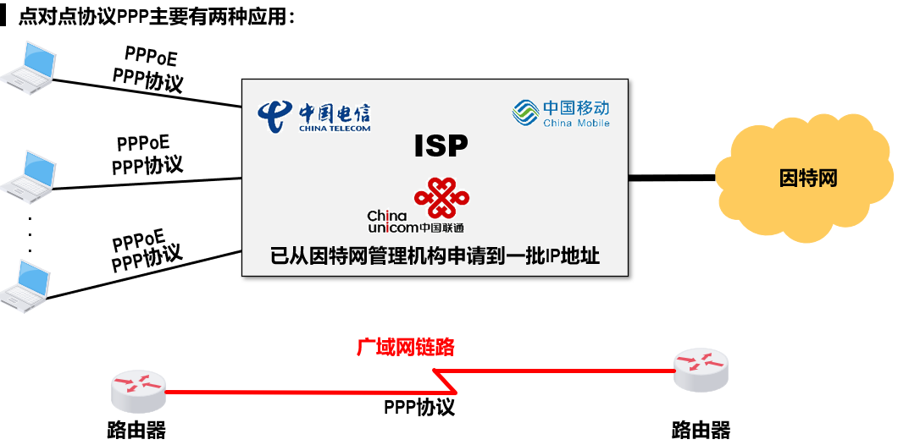
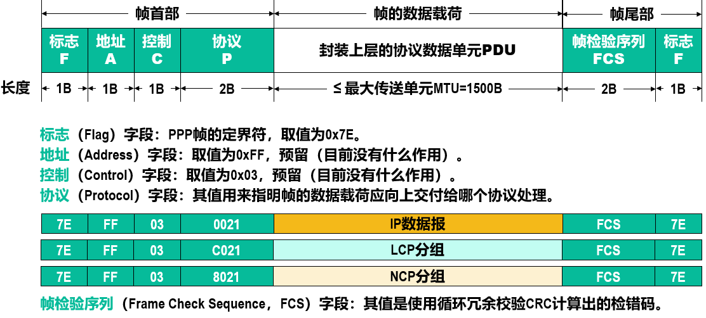
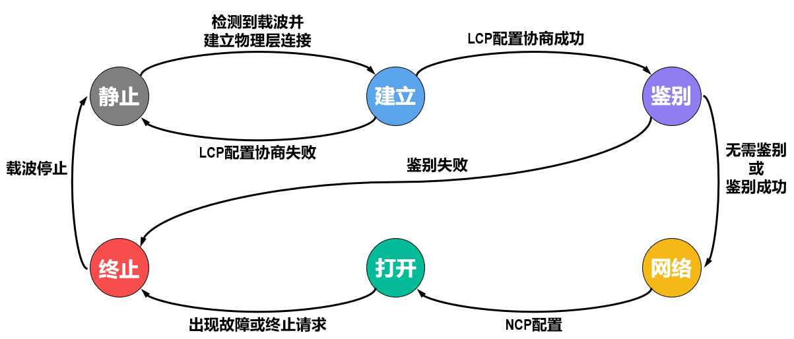

# 点对点协议

## 概述

点对点协议（Point-to-Point Protocol, PPP）是目前使用最广泛的点对点数据链路层协议。

|层次|内容|
|-|-|
|网络层|TCP/IP中的IP；NovellNetWare网络操作系统中的IPX；Apple公司的AppleTalk|
|数据链路层（PPP）|一套网络控制协议NCPs一个网络层PDU封装到串行链路的方法一个链路控制协议LCP|
|物理层|面向字节的异步链路面向比特的同步链路|

## PPP帧结构

接收方每收到一个PPP帧，就进行CRC检验。若CRC检验正确，就收下这个帧；否则，就丢弃这个帧。使用PPP的数据链路层，向上提供的是不可靠数据传输服务。

## PPP工作状态

