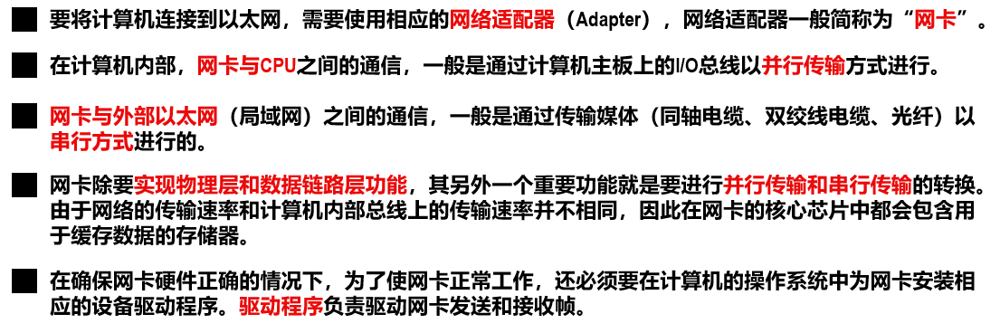
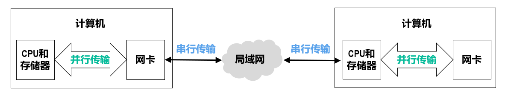
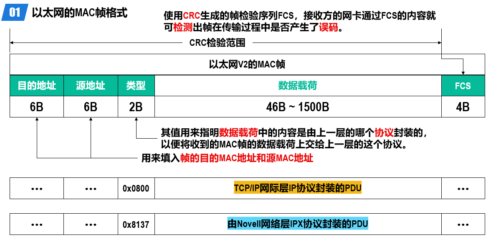
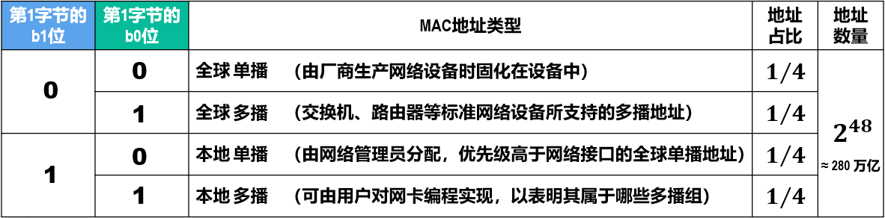

# MAC地址

## 网卡

## MAC地址

### 简介

当多个主机连接在同一个广播信道上，要想实现两个主机之间的通信，则每个主机都必须有一个唯一的标识，即一个数据链路层地址。

在每个主机发送的帧的首部中，都携带有发送主机（源主机）和接收主机（目的主机）的数据链路层地址。由于这类地址是用于媒体接入控制（Medium Access Control，MAC）的，因此被称为MAC地址。

MAC地址一般被固化在网卡的电可擦可编程只读存储器EEPROM中，因此MAC地址也被称为硬件/物理地址。但其属于**数据链路层**而非物理层。

一般情况下，普通用户计算机包含两块网卡：一块是用于接入有线局域网的以太网卡，另一块是用于接入无线局域网的Wi-Fi网卡，每块网卡都有一个全球唯一的MAC地址；交换机和路由器往往具有更多的网络接口，所以会拥有更多的MAC地址。综上所述，严格来说，MAC地址是对网络上各接口的唯一标识，而不是对网络上各设备的唯一标识。

### 格式

IEEE 802.3

字节发送顺序：第1字节->第6字节
字节内的比特发送顺序：b0->b7

对与48比特MAC地址，总数为2^48，可由第一字节的b1，b0位分类如下

b1, b2=1时，剩余46比特为“全1”时，就是广播地址FF-FF-FF-FF-FF-FF

## 运行

网卡从网络上每收到一个帧，就检查帧首部中的目的MAC地址，按以下情况处理：

1. 如果目的MAC地址是广播地址（FF-FF-FF-FF-FF-FF），则接受该帧。
2. 如果目的MAC地址与网卡上固化的全球单播MAC地址相同，则接受该帧。
3. 如果目的MAC地址是网卡支持的多播地址，则接受该帧。
4. 除上述情况外，丢弃该帧。

网卡还可被设置为一种特殊的工作方式：`混杂方式`（PromiscuousMode）。工作在混杂方式的网卡，只要收到共享媒体上传来的帧就会收下，而不管帧的目的MAC地址是什么。

嗅探器（`Sniffer`）就是一种工作在混杂方式的网卡，再配合相应的工具软件（`WireShark`），就可以作为一种非常有用的网络工具来学习和分析网络。

目前大多数移动设备都已经采用了随机MAC地址技术
