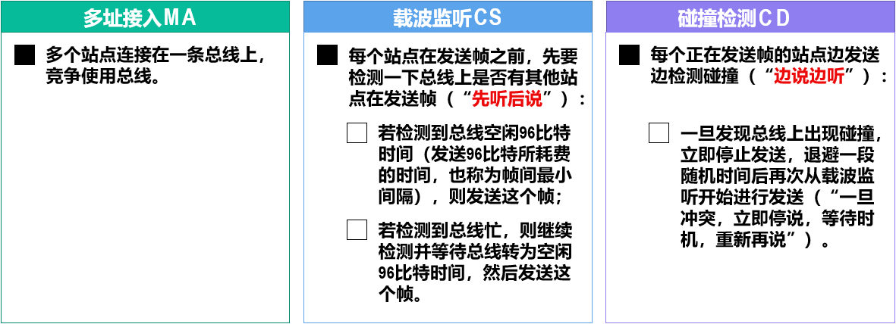
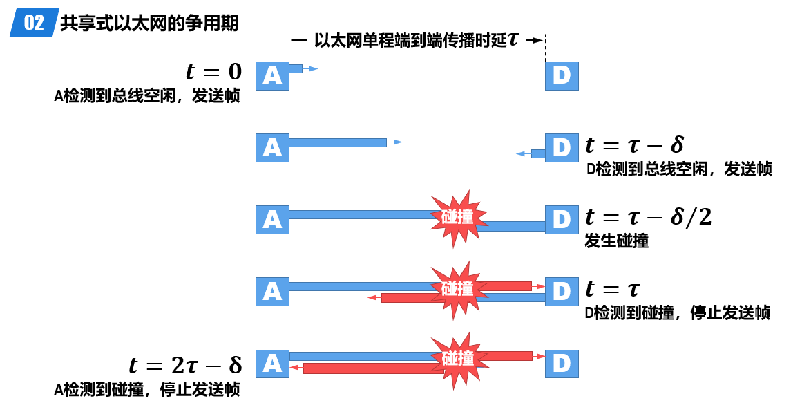
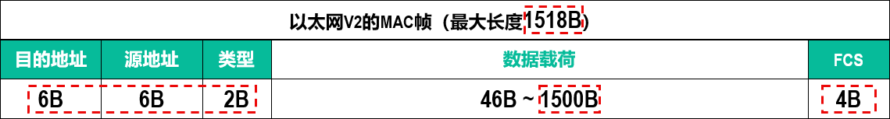
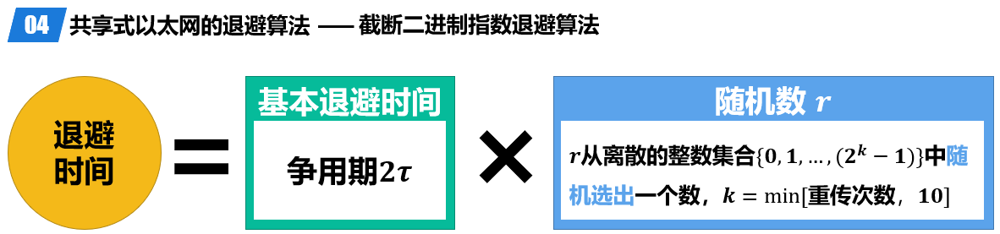

# CSMA/CD协议

## 共享总线以太网

在以太网的发展初期，人们将多个站点连接在一条总线上来构建共享总线以太网。

共享总线以太网具有天然的广播特性，即使发送单播帧，表示帧的信号也会沿着总线传播到总线上的其他各站点。

当某个站点在总线上发送帧时，总线资源会被该站点独占。此时，如果总线上的其他站点也要在总线上发送帧，就会产生信号碰撞。

共享总线以太网使用了一种专用协议**CSMA/CD**（载波监听多址接入/碰撞检测，Carrier Sense Multiple Access Collision Detection）去解决各站点争用总线的问题。

## 简介

* 检测到总线空闲不代表总线空闲（延迟）
* 不能完全避免碰撞
* 发送帧的站点一旦检测到碰撞，除了立即停止发送帧外，还要再继续发送32比特或48比特的人为干扰信号（Jamming Signal），以便有足够多的碰撞信号使所有站点都能检测出碰撞。
* 半双工通信

## 争用期

以太网单程端到端传播时延为𝝉

站点从发送帧开始，最多经过时长𝟐𝝉 （即𝜹→𝟎）就可检测出所发送的帧是否遭遇了碰撞。站点从发送帧开始，经过争用期𝟐𝝉这段时间还没有检测到碰撞，就可以肯定这次发送不会产生碰撞。

共享总线以太网的端到端往返时间𝟐𝝉被称为争用期（Contention Period）或碰撞窗口（Collision Window）。

为了确保共享总线以太网上的每一个站点在发送完一个完整的帧之前，能够检测出是否产生了碰撞，帧的发送时延就不能少于共享总线以太网端到端的往返时间，即一个争用期𝟐𝝉 。

对于𝟏𝟎Mbps的共享总线以太网，其争用期𝟐𝝉 的值规定为51.2𝝁s，因此其最小帧长为512b，即64B。

由于发送帧的站点边发送帧边检测碰撞，一旦检测到碰撞就立即中止帧的发送，此时已发送的数据量一定小于64B。因此，接收站点收到长度小于64B的帧，就可判定这是一个遭遇了碰撞而异常中止的无效帧，将其丢弃即可。

## 帧长

最小帧长：46+6+6+2+4==64
同时也需要避免帧太长，否则会导致缓冲区溢出、总线忙的问题

## 退避算法

如果连续多次发送碰撞，就表明可能有较多的站点参与竞争信道。但使用上述退避算法可使重传需要推迟的平均时间随重传次数而增大（即动态退避），因而减小产生碰撞的概率。
当重传达16次仍不能成功时，就表明同时打算发送帧的站点太多，以至于连续产生碰撞，此时应放弃重传并向高层报告。
