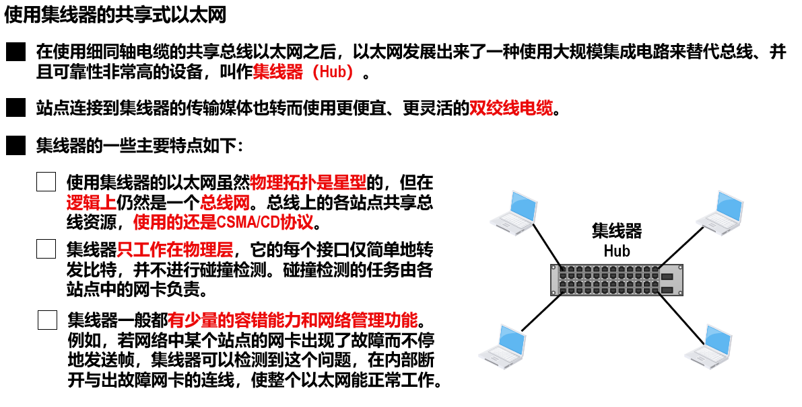
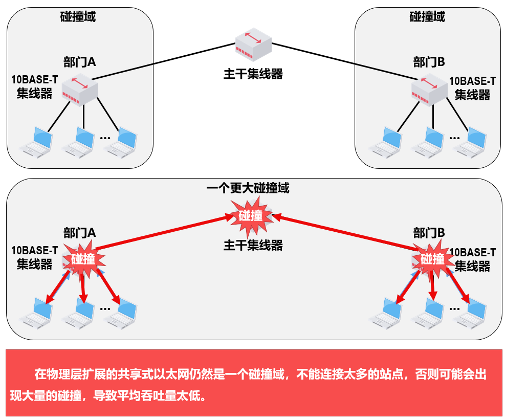
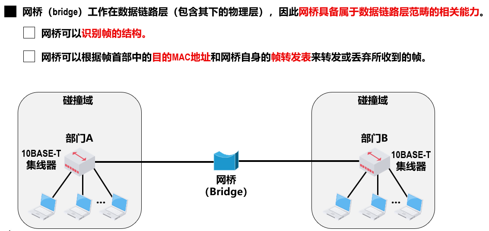
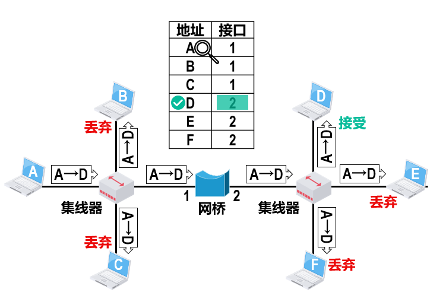
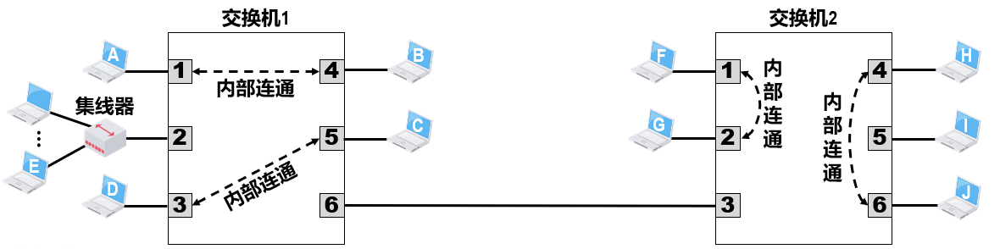
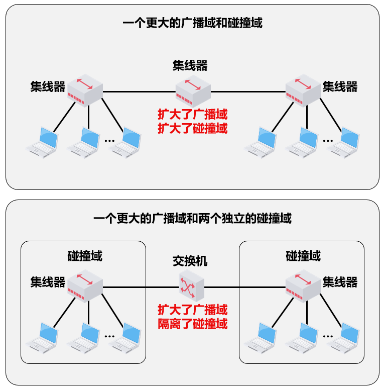

# 集线器

## 简介

需要注意，集线器只工作在物理层

多个集线器可以连接成覆盖更大范围、连接更多站点的多级星型以太网。

# 网桥

## 简介

网桥的接口数量很少，通常只有2~4个，一般只用来连接不同的网段。

其中每个碰撞域也可称为网段（Segment）

网桥维护着一个转发表，记录每个地址（设备）对应的网桥端口，当在接口1接收到一个A->D的信号，若在转发表中发现D对应2接口，就将A->D发送到D所在的网段（接口2）

若广播的目的MAC地址为FF-FF-FF-FF-FF-FF，则选择向其他接口广播该广播帧

## 透明网桥

通过自学习算法建立转发表的网桥。标准为IEEE 802.1D
简单来说，如果接收到A->B，逻辑如下

1. 检查A是否记录到表中，未则登记（自学习），登记的内容为帧的源MAC地址和进入网桥的接口号。
2. 检查B是否在表中：
   * 有则明确转发到对应端口（若为原端口则丢弃）
   * 无则盲目转发到其他所有端口

注意点

* 有误码直接丢弃
* 广播帧则直接转发
* 记录是有有效时间的

各站点并不知道自己所发送的帧将会经过哪些网桥的转发，最终到达目的站点，或者说，以太网中的各网桥对于各站点而言是看不见的。

## 生成树协议STP

有时会引入多个透明透明网桥来提供冗余链路以提高可靠性。但是这可能导致环路，出现广播帧的循环。

使用生成树协议（Spanning Tree Protocol，STP），网桥之间通过交互网桥协议单元（Bridge Protocol Data Unit，BPDU），找出原网络拓扑的一个连通子集（即生成树），并且控制对应接口的开启关闭，在这个子集里整个连通的网络中不存在环路。

当首次连接网桥或网络拓扑发生变化时，网桥都会重新构造生成树，以确保网络的连通。

# 交换机

## 简介

交换式集线器（Switching Hub），实质上是具有多个接口的网桥，常称为以太网交换机（Switch）或二层交换机。其也使用STP和转发表。

当交换机的接口与计算机或交换机连接时，可以工作在全双工方式，并能在自身内部同时连通多对接口，使每一对相互通信的计算机都能像独占传输媒体那样，无碰撞地传输数据，这样就不需要使用CSMA/CD协议了。

当交换机的接口连接的是集线器时，该接口就只能使用CSMA/CD协议并只能工作在半双工方式。

一般的交换机都采用“存储转发”方式，为了减小交换机的转发时延，某些交换机采用了直通（Cut-Through）交换方式，在接收帧的同时就立即按帧的目的MAC地址决定该帧的转发接口（不检查差错），然后通过其内部基于硬件的交叉矩阵进行转发，而不必把整个帧先缓存后再进行处理。

交换式以太网的网络性能远高于共享式以太网，集线器早已被交换机取代。

# 以太网和上述设备

以太网的标准拓扑结构为总线型拓扑，但当前的快速以太网（100BASE-T、1000BASE-T标准）为了减少冲突，将能提高的网络速度和使用效率最大化，使用交换机（Switch hub）来进行网络连接和组织。如此一来，以太网的拓扑结构就成了星型。

实际应用中，以太网在逻辑上仍然使用总线型拓扑和CSMA/CD（Carrier Sense Multiple Access/Collision Detection，即载波多重访问/碰撞侦测）的总线技术。当网络负载较重时，会造成效率的降低，当然这可以使用交换技术来弥补。
