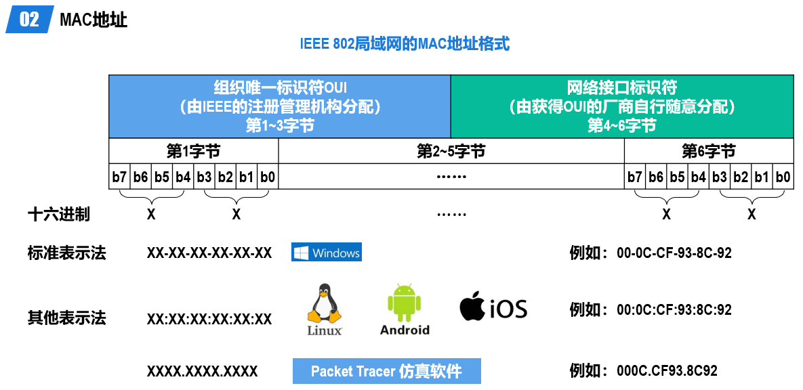

# 以太网MAC帧格式

## 简介

在以太网链路上的数据包称作以太帧。以太帧起始部分由前导码和帧开始符组成。后面紧跟着一个以太网报头，以MAC地址说明目的地址和源地址。帧的中部是该帧负载的包含其他协议报头的数据包（例如IP协议）。以太帧由一个32 bit（4 byte）冗余校验码结尾。它用于检验数据传输是否出现损坏。

802.3帧是以太网帧的一种，以太帧有很多种类型。不同类型的帧具有不同的格式和MTU值。但在同种物理媒体上都可同时存在。

* 以太网第二版[note 3] 或者称之为Ethernet II 帧，DIX帧，是最常见的帧类型。并通常直接被IP协议使用。
* Novell的非标准IEEE 802.3帧变种。
* IEEE 802.2逻辑链路控制 (LLC) 帧
* 子网接入协议(SNAP)帧

常用的以太网MAC帧格式有两种标准，一种是DIX Ethernet V2标准（即以太网V2标准），另一种是IEEE的802.3标准。以太网V2标准使用的更加广泛，是最常见的帧类型，并通常直接被IP协议使用。它们仅“类型”字段有差别。

## DIX Ethernet V2

接收方收到无效的MAC帧时，就简单将其丢弃，以太网的数据链路层没有重传机制。
可能收到的无效MAC帧包括以下几种：

* MAC帧的长度不是整数个字节
* 通过MAC帧的FCS字段的值检测出帧有误码
* MAC帧的长度不在64~1518字节之间
