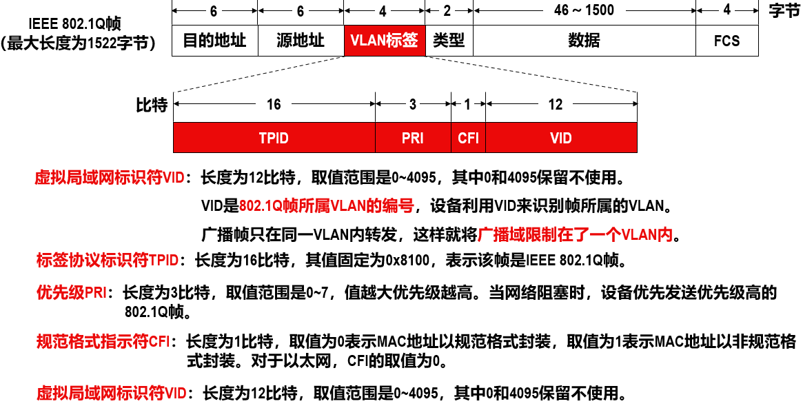
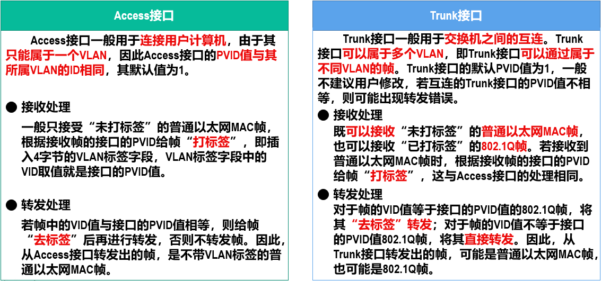

# VLAN

## 简介

多个站点通过一个或多个以太网交换机连接起来就构建出了交换式以太网，其中所有站点都属于同一个广播域。
巨大的广播域会带来广播风暴和管理维护问题。

解决方法：

* 使用路由器可以隔离广播域（成本高）
* 虚拟局域网（Virtual Local Area Network，VLAN）

虚拟局域网是一种将局域网内的站点划分成与物理位置无关的逻辑组的技术，一个逻辑组就是一个VLAN，VLAN中的各站点具有某些共同的应用需求。

网络管理员可对局域网中的各交换机进行配置来建立多个逻辑上独立的VLAN，其本质是一种服务。
连接在同一交换机上的多个站点可以属于不同的VLAN，而属于同一VLAN的多个站点可以连接在不同的交换机上。
属于同一VLAN的站点之间可以直接进行通信，而不同VLAN中的站点之间不能直接通信。
有VLAN标记的帧对应IEEE 802.1Q帧，在源地址字段和类型字段之间插入了4字节的VLAN标签（tag）字段。

当交换机收到普通的以太网MAC帧时，会给其插入4字节的VLAN标签使之成为802.1Q帧，该处理简称为“打标签”。
当交换机转发802.1Q帧时，可能会删除其4字节的VLAN标签使之成为普通的以太网MAC帧，该处理简称为“去标签”。（是否进行“去标签”处理取决于交换机的接口类型）

根据接口在接收帧和发送帧时对帧的处理方式的不同，以及接口连接对象的不同，以太网交换机的接口类型一般分为Access和Trunk两种。

华为交换机有Hybrid类型，结合了两者，并且Hybrid接口会查看帧的VID值是否在接口的**去标签**列表中，若存在则**去标签**后转发，若不存在则直接转发。

当以太网交换机上电启动后，若之前未对其各接口进行过VLAN的相关设置，则各接口的接口类型默认为Access，各接口的缺省VLAN ID为1，即各接口默认属于VLAN1。

缺省VLAN ID对于思科交换机称为本征VLAN（Native VLAN）对于华为交换机，接口的缺省VLAN ID称为端口VLAN ID（PVID）。

[VLAN详细流程](https://www.bilibili.com/video/BV1c4411d7jb?p=40)
