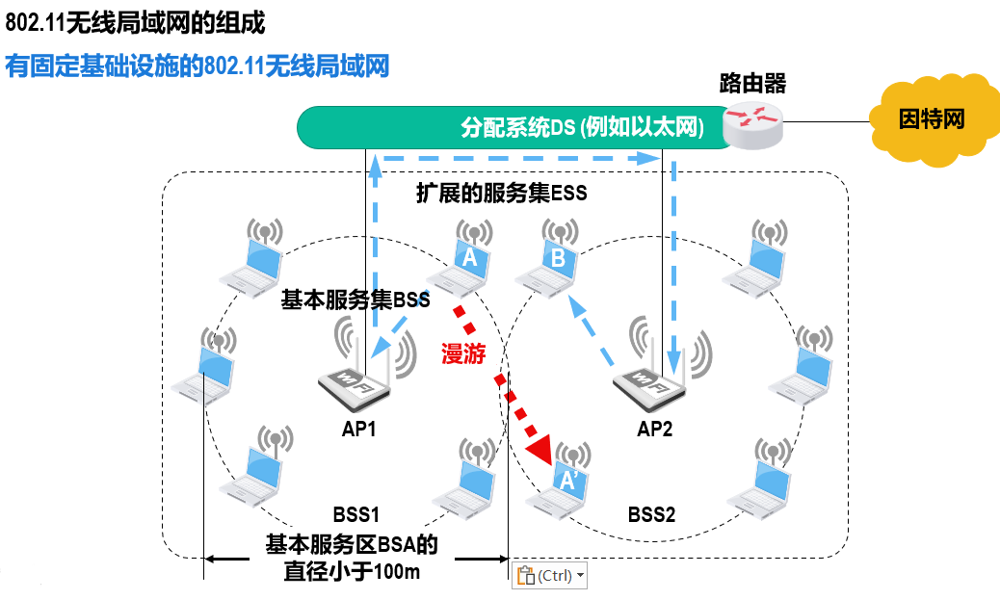
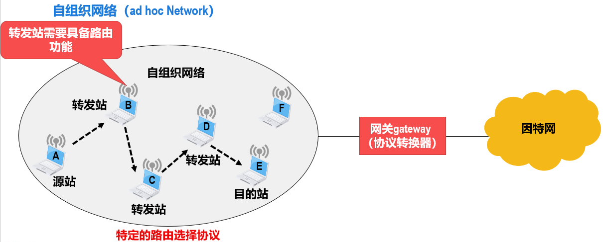
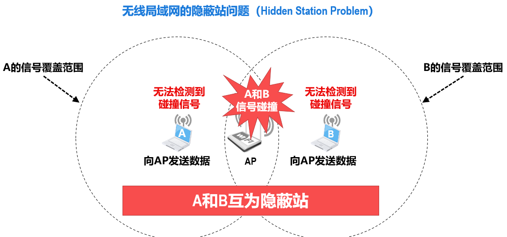
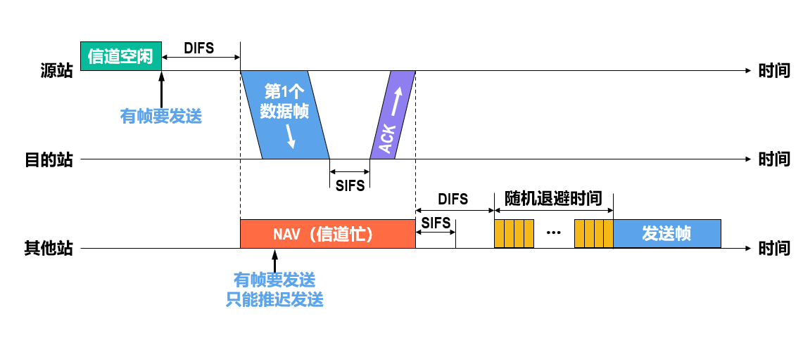
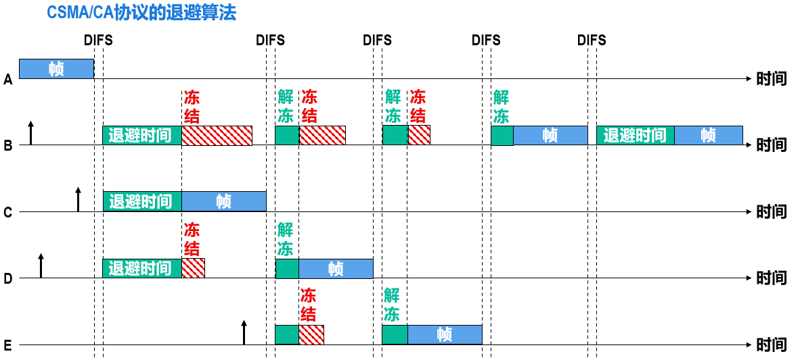
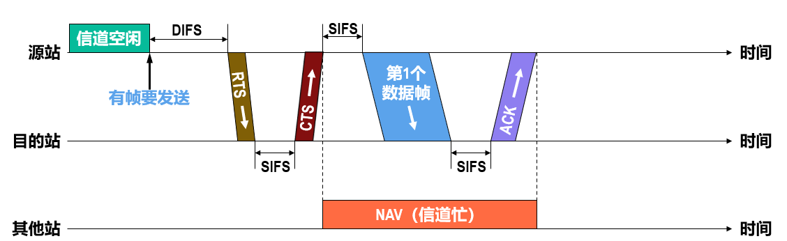
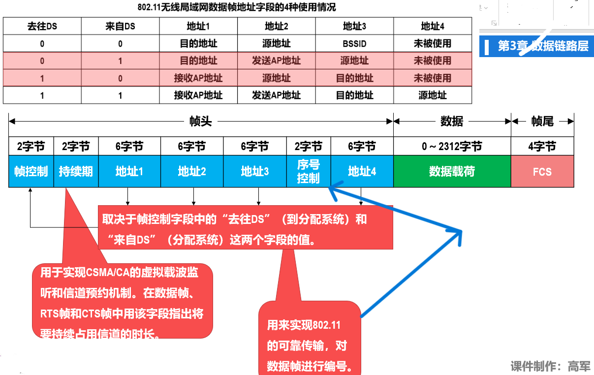

# WLAN

## 简介

无线局域网（Wireless Local Area Network，WLAN）
IEEE于1997年制定出了无线局域网的协议标准802.11，即802.11无线局域网（Wi-Fi）

## 结构

### 有固定基础设施

本BSS内各站点之间的通信以及与本BSS外的站点之间的通信，都必须经过本BSS内的AP进行转发。

网络管理员需要为AP分配一个最大32字节的服务集标识符（Service Set Identifier，SSID）和一个无线通信信道，SSID实际上就是使用该AP的802.11无线局域网的名字。

有固定基础设施的802.11无线局域网规定了以下两种服务

1. 关联（Association）服务
移动站与接入点AP建立关联的方法有以下两种：
   * 被动扫描：AP发出信标帧给移动站，告知SSID，MAC地址以及一些设置。
   * 主动扫描：移动站发出探测请求帧，AP接收到后返回探测响应帧。
2. 重建关联（Reassociation）服务和分离（Dissociation）服务
如果一个移动站要把与某个接入点AP的关联转移到另一个AP，就可以使用重建关联服务；若要终止关联服务，就应使用分离服务。

### 无固定基础设施

## CSMA/CA

802.11无线局域网采用了另一种称为CSMA/CA协议（载波监听多址接入/碰撞避免，Carrier Sense Multiple Access/Collision Avoidance，CSMA/CA）来解决类似共享式以太网的争用、碰撞的问题。

为什么不使用CSMA/CD协议？

* 无线信道环境复杂、信号强度变化大，碰撞检测要求高
* 隐蔽站问题

### 隐蔽站

### 简介

* `DIFS`：`DCF`帧间间隔`DIFS`的长度为128𝝁𝒔，在DCF方式中，DIFS用来发送数据帧和管理帧。等待DIFS间隔是考虑到可能有其他的站有高优先级的帧要发送。
* `DCF`：分布式协调功能（Distributed Coordination Function，DCF）。在DCF方式下，没有中心控制站点，每个站点使用CSMA/CA协议通过争用信道来获取发送权。DCF方式是802.11定义的默认方式（必须实现）。
* `SIFS`：短帧间间隔Short Interframe Space，长度为28𝝁𝒔，它是最短的帧间间隔，用来分隔开属于一次对话的各帧。一个站点应当能够在这段时间内从发送方式切换到接收方式。使用SIFS的帧类型有ACK帧、CTS帧等。
* `停止-等待`：由于无线信道的误码率较高，CSMA/CA协议还需要使用停止-等待的确认机制来实现可靠传输，这与使用CSMA/CD协议的共享式以太网不同。
* `退避`：当某个站在发送帧时，很可能有多个站都在监听信道并等待发送帧，一旦信道空闲，这些站几乎同时发送帧而产生碰撞。为了避免上述情况，所有要发送帧的站检测到信道从忙转为空闲后，都要执行退避算法。这样不仅可以减少发生碰撞的概率，还可避免某个站长时间占用无线信道。
当某个站要发送数据帧时，仅在这种情况下才不使用退避算法：检测到信道空闲，并且该数据帧不是成功发送完上一个数据帧之后立即连续发送的数据帧。除此之外的以下情况，都必须使用退避算法：在发送帧之前检测到信道处于忙态；在每一次重传一个帧时；在每一次成功发送帧后要连续发送下一个帧时。

### 退避算法

在执行退避算法时，站点为退避计时器设置一个随机的退避时间：

* 当退避计时器的时间减小到零时，就开始发送数据；
* 当退避计时器的时间还未减小到零时而信道又转变为忙状态，这时就冻结退避计时器的数值，重新等待信道变为空闲，再经过帧间间隔DIFS后，继续启动退避计时器。

在进行第i次退避时，退避时间在时隙编号{0，1，… ，2^(𝟐+i)−1}中随机选择一个，然后乘以基本退避时间（也就是一个时隙的长度）就可以得到随机的退避时间。当时隙编号达到255时（对应于第6次退避）就不再增加了。

### 信道预约

RTS（Request To Send）帧是短的控制帧，它包括源地址、目的地址和本次通信（包括目的站发回确认帧所需的时间）所需的持续时间。
CTS（Clear To Send）帧是短的响应控制帧，它也包括本次通信所需的持续时间（从RTS帧中将此持续时间复制到CTS帧中）。

除源站和目的站的其他各站，在收到CTS帧或数据帧后就推迟访问信道。这样就确保了源站和目的站之间的通信不会受到其他站的干扰。
若RTS帧发生碰撞，源站就不可能收到CTS帧，源站会执行退避算法重传RTS帧。

使用RTS帧和CTS帧进行信道预约会带来额外的开销。但由于RTS帧和CTS帧都很短，发生碰撞的概率、碰撞产生的开销以及本身的开销都很小。对于一般的数据帧，其发送时延往往远大于传播时延（因为是局域网），碰撞的概率很大，且一旦发生碰撞而导致数据帧重发，则浪费的时间就很多，因此用很小的代价对信道进行预约往往是值得的。

由于RTS帧和CTS帧都会携带通信需要持续的时间，这与之前介绍过的数据帧可以携带通信所需持续时间的虚拟载波监听机制是一样的，因此使用RTS帧和CTS帧进行信道预约，也属于虚拟载波监听机制。

利用虚拟载波监听机制，站点只要监听到数据帧、RTS帧或CTS帧中的任何一个，就能知道信道将被占用的持续时间，而不需要真正监听到信道上的信号，因此虚拟载波监听机制能减少隐蔽站带来的碰撞问题。

## MAC帧

### 802.11无线局域网的数据帧格式

