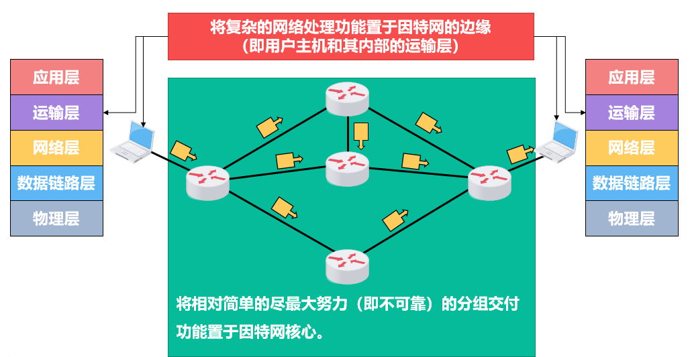

# 概述

## 功能

网络层的主要任务就是将分组从源主机经过多个网络和多段链路传输到目的主机，可以将该任务划分为**分组转发**和**路由选择**。

其向上层提供了**面向连接的虚电路服务**和**无连接的数据报服务**

## 面向连接的虚电路服务

核心思想是可靠通信应由网络自身来保证
必须首先建立网络层连接接一虚电路（VirtualCircuit，VC），以保证通信双方所需的一切网络资源。
通信双方沿着已建立的虚电路发送分组
通信结束后，需要释放之前所建立的虚电路。

这种通信方式如果再使用可靠传输的网络协议，就可使所发送的分组最终正确（无差错按序到达、不丢失、不重复）到达接收方。

然而，因特网的先驱者并没有采用这种设计思想，而是采用了无连接的数据报服务。

## 无连接的数据报服务

核心思想是可靠通信应由用户主机来保证.
不需要建立网络层连接每个分组可走不同的路径。每个分组的首部都必须携带目的主机的完整地址。
通信结束后，没有需要释放的连接。

所传送的分组可能误码、丢失、重复和失序。

网络自身不提供端到端的可靠传输服务，这使得其造价降低。

