# IPv4地址

## 简介

IPv4地址是给因特网（Internet）上的每一个主机（或路由器）的每一个接口分配的一个在全世界范围内唯一的32比特的标识符。

## 结构

由于IPv4地址由32比特构成，不方便阅读、记录以及输入等，因此IPv4地址采用点分十进制表示方法以方便用户使用。

00001010.11110000.00001111.10101010:arrow_right:10.204.15.170

其分为网络号和主机号两部分
|网络号|主机号|
|-|-|
|标志主机（或路由器）的接口所连接的网络|标志主机（或路由器）的接口|
|同一个网络中，不同主机（或路由器）的接口的IPv4地址的网络号必须相同，表示它们属于同一个网络。|同一个网络中，不同主机（或路由器）的接口的IPv4地址的主机号必须各不相同，以便区分各主机（或路由器）的接口。|

## 分类编址

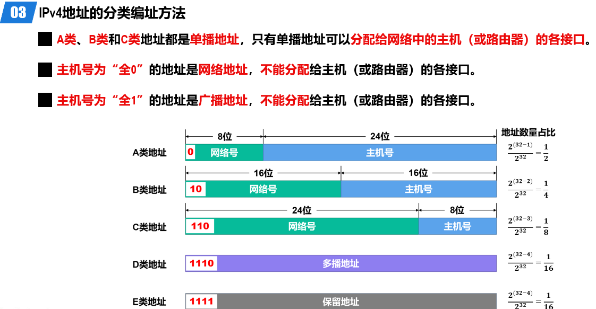

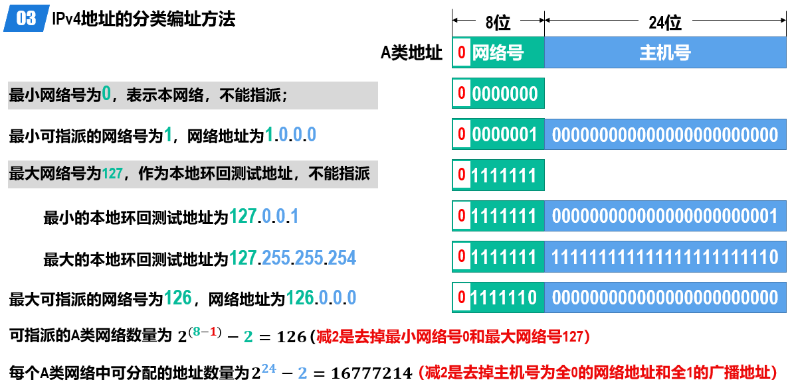

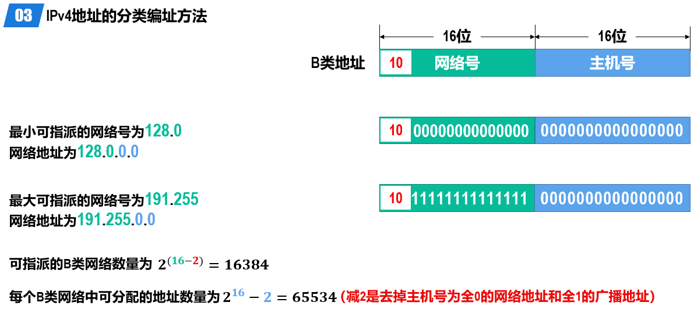

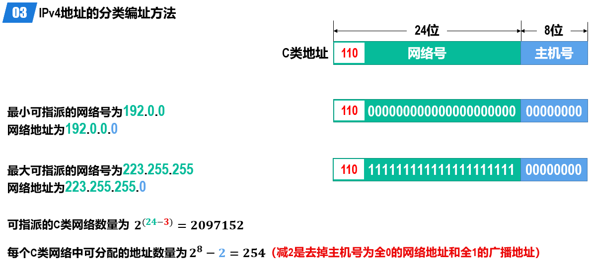

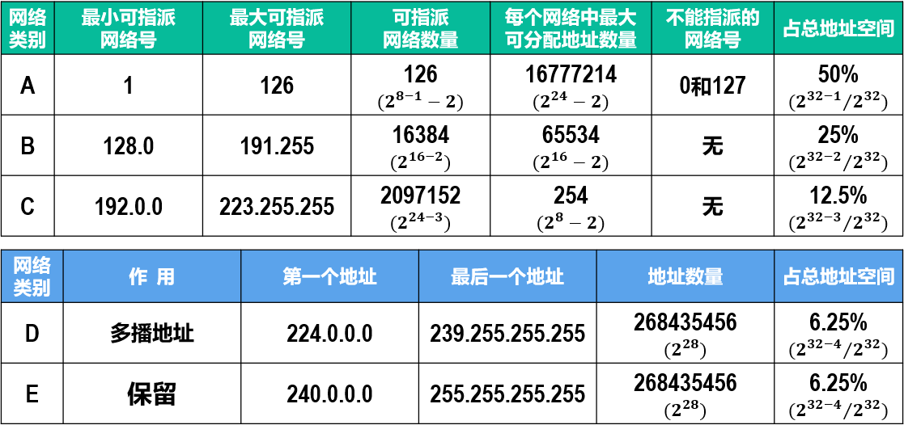

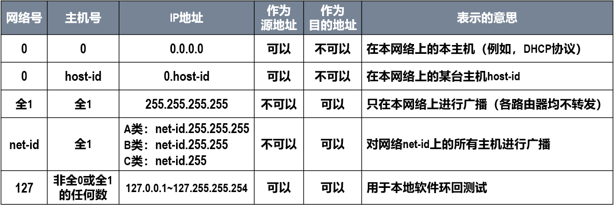

显然，IPv4分类编址方法不够灵活、容易造成大量IPv4地址资源浪费

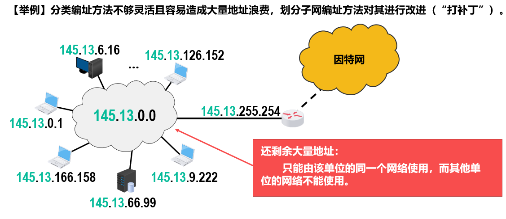

## 划分子网编址

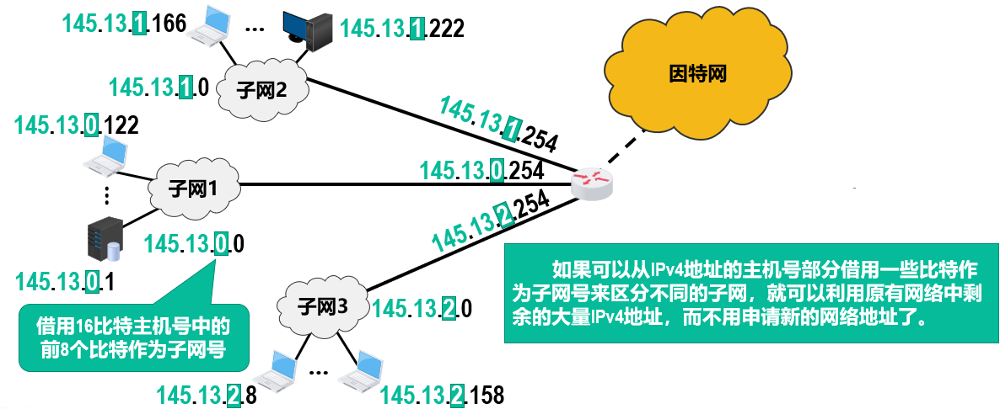

`子网掩码`：表明分类IPv4地址的主机号部分被借用了几个比特作为子网号。
与IPv4地址类似，`子网掩码`也是由32比特构成的。
用左起多个连续的比特1对应IPv4地址中的网络号和子网号；
之后的多个连续的比特0对应IPv4地址中的主机号。
将划分子网的IPv4地址与相应的子网掩码进行逐比特的逻辑与运算，就可得到该IPv4地址所在子网的网络地址。

或者说，子网掩码是用来标识IP地址中哪些部分用作网络、子网号。
||原|转换后|
|-|-|-|
|C类网络地址|218.75.230.0|218.75.230.00000000|
|子网掩码|255.255.255.128|255.255.255.10000000|

可知除了原来的218.75.230外，还借用了1位作为子网掩码。

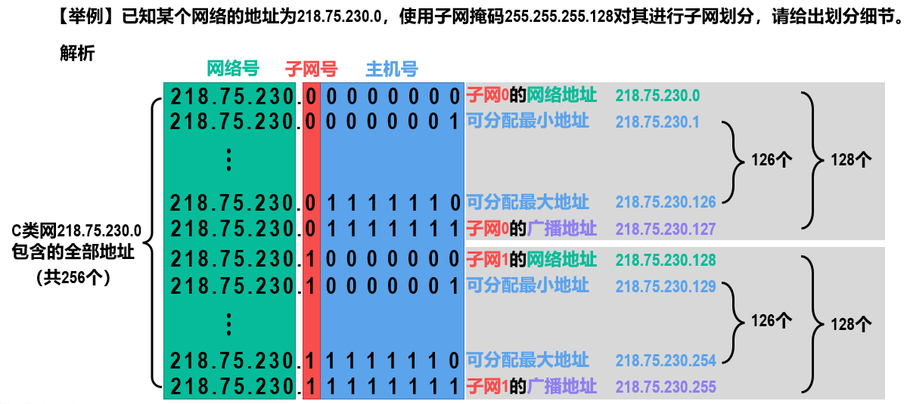

## 无分类编址

后来还是不够用，就取消上面两个，使用地址掩码

网络前缀是不定长的，仅从IPv4地址自身是无法确定其网络前缀和主机号的，需要配合使用32比特的地址掩码。
用左起多个连续的比特1对应IPv4地址中的网络前缀；之后的多个连续的比特0对应IPv4地址中的主机号。

也可以用斜杠记
128.14.35.7/20 表示网络前缀有20比特
前20位对应着一个CIDR地址块

### 路由聚合/构造超网

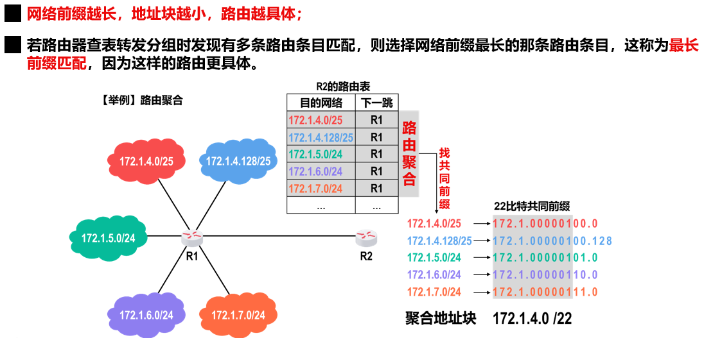

## 定长/变长子网掩码（略）

可以根据不同的网络规模，给不同网络划分不同长度的子网掩码。

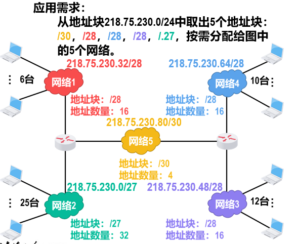

## IPv4与MAC

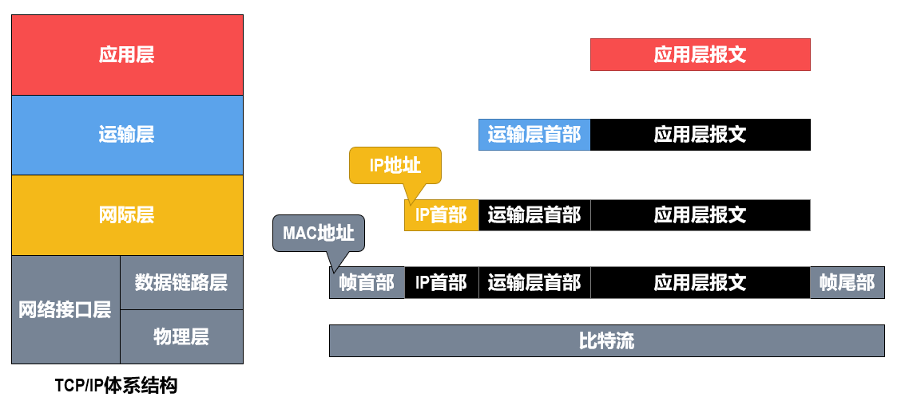

在数据包的传送过程中，数据包的源IP地址和目的IP地址保持不变。
在数据包的传送过程中，数据包的源MAC地址和目的MAC地址逐链路（或逐网络）改变。
