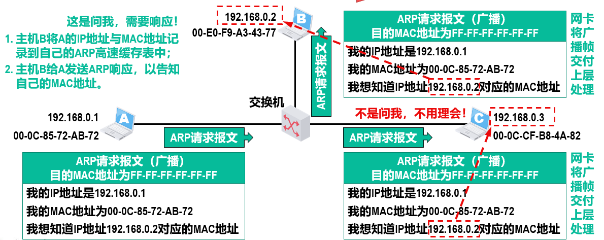

# ARP

## 问题

如果仅使用MAC地址进行通信

* 因特网中的每台路由器的路由表中必须记录因特网上所有主机和路由器各接口的MAC地址。
* 手工给各路由器配置路由表几乎是不可能完成的任务，即使使用路由协议让路由器通过相互交换路由信息来自动构建路由表，也会因为路由信息需要包含海量的MAC地址信息而严重占用通信资源。
* 包含海量MAC地址的路由信息需要路由器具备极大的存储空间，并且会给分组的查表转发带来非常大的时延。

因特网的网际层使用IP地址进行寻址，就可使因特网中各路由器的路由表中的路由记录的数量大大减少，因为只需记录部分网络的网络地址，而不是记录每个网络中各通信设备的各接口的MAC地址。

路由器收到IP数据报后，根据其首部中的目的IP地址的网络号部分，基于自己的路由表进行查表转发。
查表转发的结果可以指明IP数据报的下一跳路由器的IP地址，但无法指明该IP地址所对应的MAC地址。因此，在数据链路层封装该IP数据报成为帧时，帧首部中的目的MAC地址字段就无法填写，该问题需要使用网际层中的地址解析协议ARP来解决。

## 简介

分为以下几个流程

### 查找阶段

### 询问阶段

### 响应阶段

### 记录与发送阶段

转发表中的MAC地址与交换机接口号的对应关系记录也要周期性删除，因为这种对应关系并不是永久不变的。
同理，ARP高速缓存表中的IP地址与MAC地址的对应关系也并不是永久不变的，也需要定期删除。

### 其他

ARP协议还有其他类型的报文，例如用于检查IP地址冲突的“无故ARP”（Gratuitous ARP）。

ARP协议没有安全验证机制，存在ARP欺骗和攻击等问题。

由于ARP协议的主要用途是从网际层使用的IP地址解析出在数据链路层使用的MAC地址。ARP协议可以划归在网际层或数据链路层。
