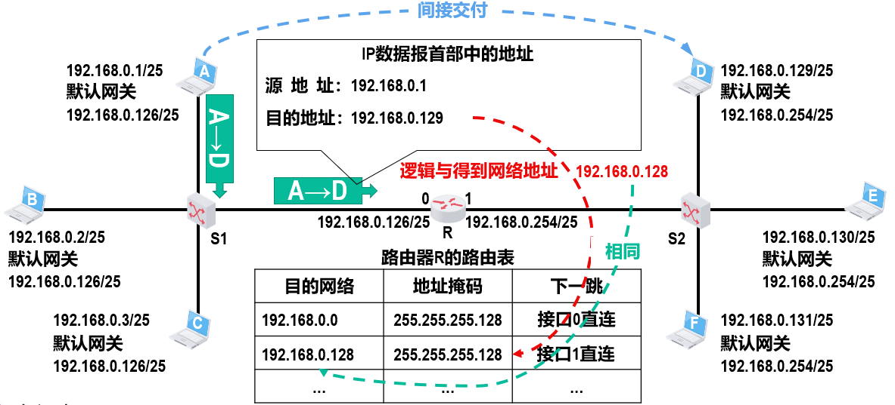
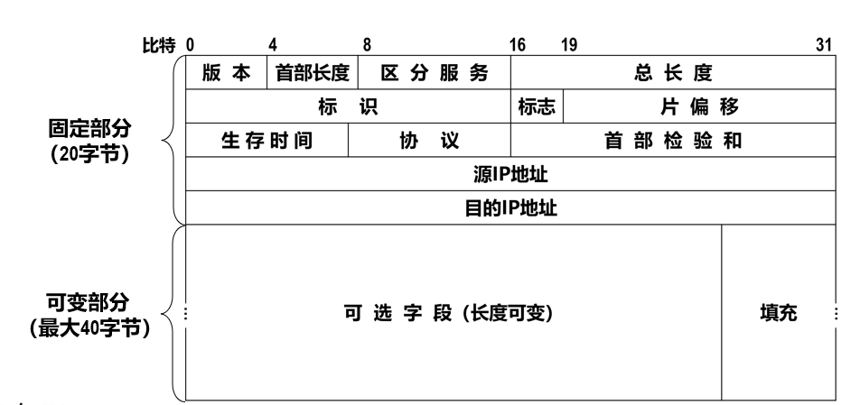
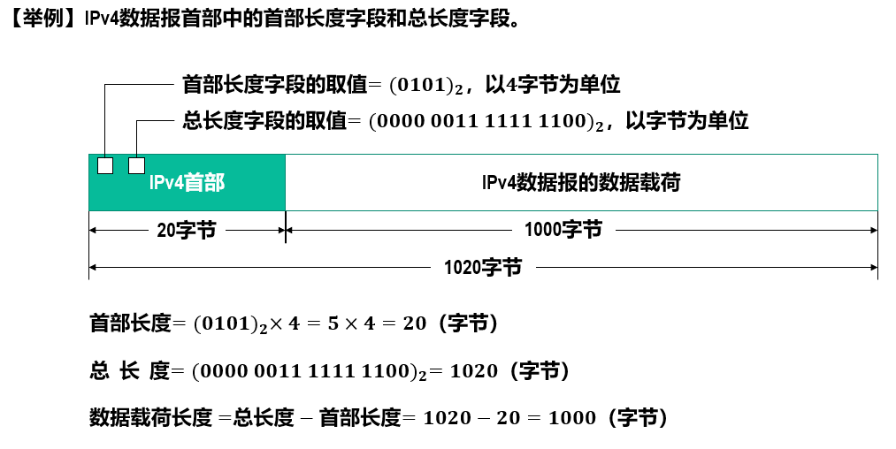
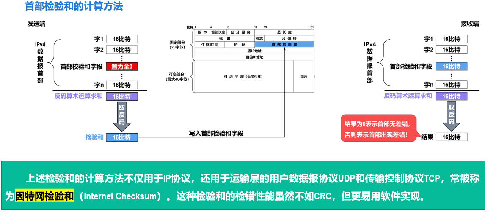
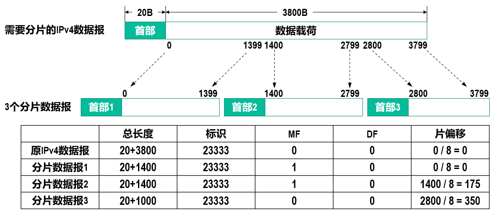

# IP数据报

## 简介

TCP/IP协议定义了一个在因特网上传输的包，称为IP数据报，由首部和数据两部分组成

IP协议控制传输的协议单元称为IP数据报（IP Datagram，IP数据报、IP包或IP分组）。

IP协议屏蔽了下层各种物理子网的差异，能够向上层提供统一格式的IP数据报。

IP数据报采用数据报分组传输的方式，提供的服务是无连接方式。

## 流程

忽略

* 使用ARP协议来获取目的主机或路由器接口的MAC地址的过程。
* 以太网交换机自学习和转发帧的过程。

仅关注

* 主机发送IP数据报
* 路由器转发IP数据报

### 判断

首先根据IP地址的前25比特（网络号）取出，和自己的IP地址比对

* 相同：说明自己和对方在同一网络中，直接交付（通过路由器）即可
* 不同：不在同一网络，需要间接交付

### 间接交付

间接交付就涉及到路由器的转发，路由器会做以下工作：

1. 检查收到的IP数据报是否正确
   生存时间是否结束；首部是否误码
   若不正确，则丢弃该IP数据报，并向发送该IP数据报的源主机发送差错报告。

2. 基于IP数据报首部中的目的IP地址在路由表中进行查找。
   若找到匹配的路由条目，则按该路由条目的指示进行转发，
   否则丢弃该IP数据报，并向发送该IP数据报的源主机发送差错报告。

第二点具体来说，取路由表每条中的地址掩码与目的IP逻辑与，找到其网络号，判断获得的网络号是否与该条的网络号相同，相同则根据该条的下一跳发送数据报。

路由器不转发广播IP数据报，即路由器隔离广播域。
如果因特网中数量巨大的路由器收到广播IP数据报后都进行转发，则会造成巨大的广播风暴，严重浪费因特网资源。

## 格式

### 首部格式

1. `版本`：长度为4个比特，用来表示IP协议的版本。如4（IPv4），6。
2. `首部长度`：长度为4个比特，该字段的取值以4字节为单位，用来表示IPv4数据报的首部长度。
   最小取值为二进制的0101，即十进制的5，再乘以4字节单位，表示IPv4数据报首部只有20字节固定部分。
   最大取值为二进制的1111，即十进制的15，再乘以4字节单位，表示IPv4数据报首部包含20字节固定部分和最大40字节可变部分。
3. `可选字段`：长度从1字节到40字节不等，用来支持排错、测量以及安全措施等功能。实际很少使用。
4. `填充`：用来确保IPv4数据报的首部长度是4字节的整数倍，使用全0进行填充。
5. `总长度`：以字节为单位，用来表示IPv4数据报的长度（首部长度+数据载荷长度）
6. `生存时间`：`TTL`，长度为8个比特，最大取值为二进制的11111111，即十进制的255。
   该字段的取值最初以秒为单位。因此，IPv4数据报的最大生存时间最初为255秒。
   路由器转发IPv4数据报时，将其首部中该字段的值减去该数据报在路由器上所耗费的时间，若结果不为0就转发，否则就丢弃。
   生存时间字段后来改为以“跳数”为单位，路由器收到待转发的IPv4数据报时，将其首部中的该字段的值减1，若结果不为0就转发，否则就丢弃。
   防止被错误路由（路由环路）的IPv4数据报无限制地在因特网中兜圈。
7. `区分服务`：利用该字段的不同取值可提供不同等级的服务质量。
8. `协议`：长度为8个比特，用来指明IPv4数据报的数据载荷是何种协议数据单元PDU。
   如上层为运输层的TCP报文，则协议字段的值=6。
9. `首部检验和`：长度为16个比特，用于检测IPv4数据报在传输过程中其首部是否出现了差错。
   IPv4数据报每经过一个路由器，其首部中的某些字段的值（例如生存时间TTL、标志以及片偏移等）都可能发生变化，因此路由器都要重新计算一下首部检验和。
   由于网际层并不向其高层提供可靠传输的服务，并且计算首部检验和是一项耗时的操作，因此在IPv6中，路由器不再计算首部检验和，从而更快转发IP数据报。

#### IP数据报分片

当IPv4数据报长度超过MTU（以太网规定为1500字节）时，无法封装成帧，
需要将原IPv4数据报分片为若干个更小的IPv4数据报

1. `标识`：属于同一个IPv4数据报的各分片数据报具有相同的标识。
   软件会维持一个计数器，每产生一个IPv4数据报，计数器值就加1，并将此值赋给标识字段
2. `标志`：分为最低位（More Fragment，MF）和中间位（Don’t Fragment，DF）
   MF=1表示本分片后面还有分片，=0表示表示本分片后面没有分片
   DF=1表示不允许分片，=0表示允许分片
   最高位为保留位，必须设置为0
3. `片偏移`：长度为13个比特，
   该字段的取值以8字节为单位，用来指出分片IPv4数据报的数据载荷偏移其在原IPv4数据报的位置有多远。片偏移必须为整数。故分片的数据载荷的最大长度取<=MTU-首部长度且能整除8的最大整数。

