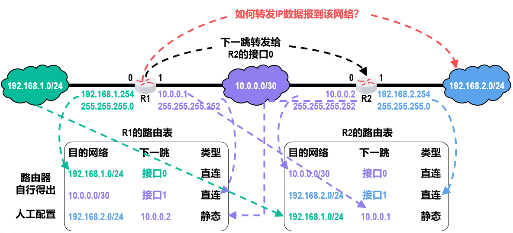

# 路由选择分类

## 静态路由

人工配置路由表，适用于小规模网络。

### 默认路由

可以设置默认路由条目
0.0.0.0/0 X.X.X.X 静态

默认路由条目中的目的网络0.0.0.0/0，其中0.0.0.0表示任意网络，而网络前缀“/0”（相应的地址掩码为0.0.0.0）是最短的网络前缀。

路由器在查找转发表转发IP数据报时，遵循“最长前缀匹配”的原则，因此默认路由条目的匹配优先级最低。

### 特定主机路由

可以设置特定主机路由条目
192.168.2.1/32 X.X.X.X 静态

特定主机路由条目中的目的网络192.168.2.1/32，其中192.168.2.1是特定主机的IP地址，而网络前缀“/32”（相应地址掩码为255.255.255.255）是最长的网络前缀。

路由器在查找转发表转发IP数据报时，遵循“最长前缀匹配”的原则，因此特定主机路由条目的匹配优先级最高。

### 问题

* 路由条目配置错误，可能导致出现路由环路。
* 聚合路由条目时可能引入不存在的网络。

## 动态路由

路由器通过路由选择协议自动获取路由信息。
动态路由选择比较复杂、开销比较大，但能较好地适应网络状态的变化。
动态路由选择适用于大规模网络。

因特网采用动态路由选择，能较好地适应网络状态的变化。
整个因特网划分为许多较小的自治系统（Autonomous System，AS）。
在自治系统内部和外部采用不同类别的路由选择协议，分别进行路由选择。
分为内部网关协议IGP和外部网关协议EGP（此处网关=路由器）
