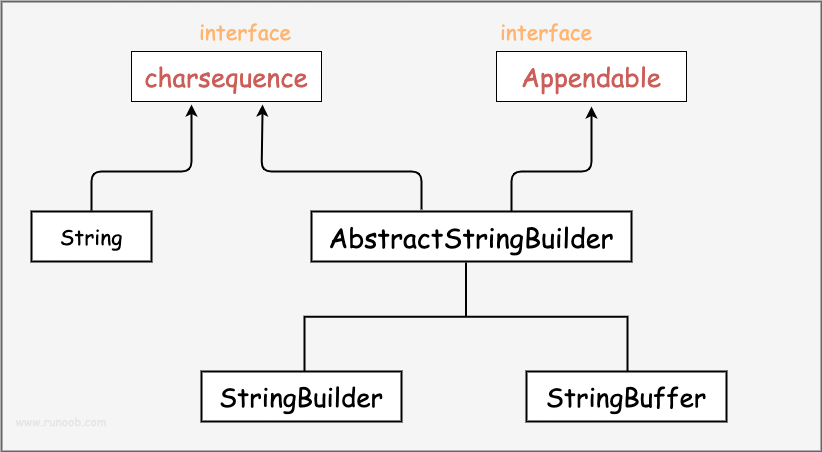

# Java字符串相关接口和类的关系与区别

## 类图关系

## 详细说明

### 1. CharSequence（接口）

- 表示一个字符序列的只读接口
- 主要方法: `length()`, `charAt()`, `subSequence()`, `toString()`
- 不可变性: 不保证

### 2. String（类）

- 实现了CharSequence接口
- 表示不可变的字符序列
- 线程安全: 是（因为不可变）
- 性能: 对于频繁修改的场景不适合

### 3. Appendable（接口）

- 表示可以追加字符序列的对象
- 主要方法: `append()`
- 不可变性: 可变

### 4. AbstractStringBuilder（抽象类）

- 实现了CharSequence和Appendable接口
- StringBuilder和StringBuffer的公共父类
- 提供了大部分字符串操作的具体实现

### 5. StringBuilder（类）

- 继承自AbstractStringBuilder
- 表示可变的字符序列
- 线程安全: 否
- 性能: 单线程环境下操作字符串的首选类

### 6. StringBuffer（类）

- 继承自AbstractStringBuilder
- 表示线程安全的可变字符序列
- 线程安全: 是（通过同步方法实现）
- 性能: 多线程环境下操作字符串的首选类，但比StringBuilder慢

## 补充说明

1. **性能考虑**:
   - 频繁修改字符串时，应使用StringBuilder（单线程）或StringBuffer（多线程）
   - 仅需要读取字符串时，使用String更高效

2. **不可变性的好处**:
   - String的不可变性使其在并发环境中更安全
   - 有利于字符串常量池的实现，可以提高内存利用率

3. **选择建议**:
   - 一般情况下，优先使用String
   - 需要频繁修改字符串时，单线程用StringBuilder，多线程用StringBuffer
   - 如果不确定线程安全性，保守选择StringBuffer
